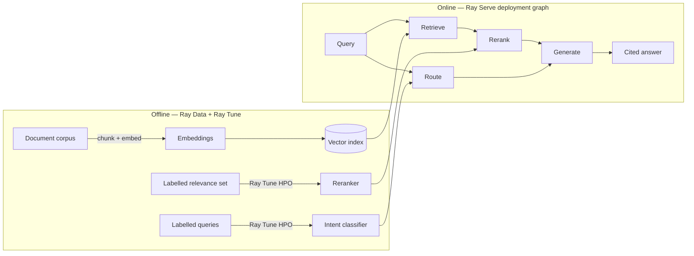

# ray-rag-intelligence

**A distributed RAG document-intelligence platform on Ray — trained ML owns retrieval ranking and query routing; the LLM only writes citation-grounded answers. One codebase, laptop to cluster.**

Ask a question over a document corpus and get back an answer where **every claim
cites the source chunk it came from**. The retrieval quality and the query
routing are owned by *trained models with measured accuracy* — not by the LLM —
so the system is auditable, not a black box that "sounds confident."

---

## Why this exists

Most "RAG" demos let the LLM do everything: rank, route, and answer. That hides
where errors come from and can't be measured. This project takes the opposite,
**anti-fake-AI** stance:

| Job | Owner | How it's measured |
|-----|-------|-------------------|
| Embed & retrieve candidates | Embedding model + vector index | recall@k |
| **Rank the evidence** | **Trained learning-to-rank model (XGBoost)** | **nDCG@k / MRR** |
| **Route the query** (factual / summarise / out-of-scope) | **Trained intent classifier** | **accuracy / macro-F1** |
| Write the grounded answer | LLM (Claude) | citation-faithfulness score |

The LLM is used *only* for what it is genuinely best at — turning ranked
evidence into fluent, **cited** language. It never ranks or routes.

## Architecture



**Ray, end to end:** Ray Data (parallel embed) → Ray Tune (parallel HPO for both
models) → Ray Serve (the online `retrieve → rerank → route → generate`
deployment graph). Ray Train's distributed-trainer path is documented as the
scale-out target (`deploy/`), not used at this data scale — see the disclaimer.

## Run it locally

> Requires Docker. CPU-only; no GPU needed. Python 3.10.

```bash
cp .env.example .env          # add your ANTHROPIC_API_KEY
docker compose up -d          # local Ray head + worker cluster
# ingest + embed the sample corpus, train the models, then serve:
make ingest && make train && make serve
# ask a question:
curl -s localhost:8000/ask -d '{"query": "..."}' | jq
```

`make ingest` builds the FAISS index from the corpus, `make train` tunes + fits
the reranker and intent classifier (saved under `artifacts/`, gitignored), and
`make serve` starts the deployment graph. `make eval` prints the metrics below.
See [RUNBOOK.md](RUNBOOK.md) for startup order and failure handling.

## Why this stack

- **Ray** gives one programming model across data, training, tuning, and serving
  — the same code runs on a laptop or a cluster, which is the whole portability
  story.
- **A learning-to-rank reranker (XGBoost) + an intent classifier** are real
  trained models that own measurable prediction, keeping the AI honest. The
  cross-encoder is used only as one ranking *feature*, not as the ranker.
- **Claude API** does the one thing an LLM should here: grounded generation.

## Results (sample corpus)

Measured by `make eval` on the bundled illustrative corpus — small by design, so
read these as a working signal, not a benchmark. The reranker is trained on
`data/eval/relevance_train.jsonl` and scored on a **disjoint** held-out test set
(`relevance_test.jsonl`), so these are generalisation numbers, not training fit:

| Metric (held-out test) | dense-only | learned rerank |
|--------|--------|--------|
| Retrieval recall@5 | 1.000 | 1.000 |
| Retrieval nDCG@5 | 0.879 | 0.854 |
| Retrieval MRR | 0.944 | 0.944 |
| Intent classifier — macro-F1 (n=23) | — | 0.774 |

Read honestly: on a corpus this small, dense retrieval is already near-ceiling —
**recall@5 is 1.000**, so every relevant document is already in the top 5 and the
reranker has nothing left to *recover*, only to reorder (MRR 0.94). So the learned
reranker reaches **held-out parity**, not uplift, and nDCG dips within noise. The
deliverable here
is the *methodology*: a reranker we train ourselves, measured on unseen queries
with nDCG/MRR, so its quality is a number that moves with training rather than a
black box. Demonstrating uplift needs a larger, noisier corpus where dense leaves
room to improve — called out under the disclaimer below.

## Honest disclaimer

- **Generation uses an external LLM API (Anthropic Claude)** on the happy path,
  because the reference machine has no GPU. This is a real API call for a real
  language task — not a mock.
- **A Ray Serve + vLLM-on-GPU serving path and an Anyscale cluster deployment
  are architected and documented (`deploy/`), but are not continuously
  running.** Treat them as the production scale-out story, not a live endpoint.
- Eval sets shipped here are **illustrative-scale**, sized to run quickly and
  reproducibly — not production-scale benchmarks.
- **The reranker reaches held-out parity with dense retrieval on this corpus, not
  uplift.** The corpus is small and clean enough that dense retrieval is already
  near-ceiling, so there is little for a reranker to add. The trained ranker and
  its held-out nDCG/MRR evaluation are the portfolio point; showing measurable
  uplift needs a larger, noisier corpus with more labelled relevance.
- **Ray Train's distributed-trainer path is documented, not used at this scale.**
  At illustrative CPU scale, Ray Tune-driven HPO is the honest fit; Ray Train is
  the documented scale-out for larger data, where data-parallel training earns its
  place. Using it here would add complexity without benefit.

## License

MIT — see [LICENSE](LICENSE).
