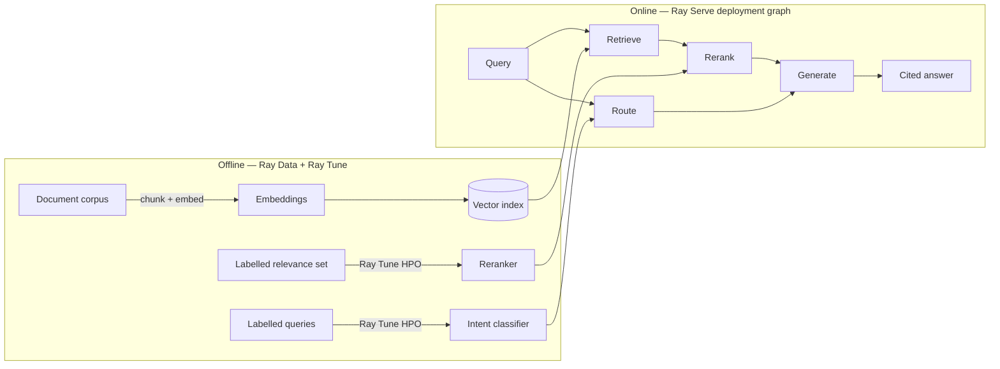

# ray-rag-intelligence

**A distributed RAG document-intelligence platform on Ray — trained ML owns retrieval ranking and query routing; the LLM only writes citation-grounded answers. One codebase, laptop to cluster.**

Ask a question over a document corpus and get back an answer where **every claim
cites the source chunk it came from**. The retrieval quality and the query
routing are owned by *trained models with measured accuracy* — not by the LLM —
so the system is auditable, not a black box that "sounds confident."

---

## Why this exists

Most "RAG" demos let the LLM do everything: rank, route, and answer. That hides
where errors come from and can't be measured. This project takes the opposite,
**anti-fake-AI** stance:

| Job | Owner | How it's measured |
|-----|-------|-------------------|
| Embed & retrieve candidates | Embedding model + vector index | recall@k |
| **Rank the evidence** | **Trained learning-to-rank model (XGBoost)** | **nDCG@k / MRR** |
| **Route the query** (factual / summarise / out-of-scope) | **Trained intent classifier** | **accuracy / macro-F1** |
| Write the grounded answer | LLM (Claude) | citation-faithfulness score |

The LLM is used *only* for what it is genuinely best at — turning ranked
evidence into fluent, **cited** language. It never ranks or routes.

## Architecture



**Ray, end to end:** Ray Data (parallel embed) → Ray Tune (parallel HPO for both
models) → Ray Serve (the online `retrieve → rerank → route → generate`
deployment graph). Ray Train's distributed-trainer path is documented as the
scale-out target (`deploy/`), not used at this data scale — see the disclaimer.

## Run it locally

> Requires Docker. CPU-only; no GPU needed. Python 3.10.

```bash
cp .env.example .env                       # add your ANTHROPIC_API_KEY
make up                                    # build + start the local Ray head + worker
# run inside the head so the steps join the cluster (artifacts are shared to the
# worker via a named volume — see docker-compose.yml):
docker compose exec ray-head make ingest   # chunk + embed the corpus into a FAISS index
docker compose exec ray-head make train    # tune + fit the reranker and intent classifier
docker compose exec ray-head make serve    # start the Serve graph on :8000 (foreground)
# from another shell, ask a question:
curl -s localhost:8000/ask -H 'Content-Type: application/json' \
  -d '{"query": "How does Ray Serve scale a deployment?"}' | jq
```

`make ingest` builds the FAISS index from the corpus, `make train` tunes + fits
the reranker and intent classifier (saved under `artifacts/`, gitignored), and
`make serve` starts the deployment graph. `make eval` prints the metrics below.
See [RUNBOOK.md](RUNBOOK.md) for startup order and failure handling.

## Why this stack

- **Ray** gives one programming model across data, training, tuning, and serving
  — the same code runs on a laptop or a cluster, which is the whole portability
  story.
- **A learning-to-rank reranker (XGBoost) + an intent classifier** are real
  trained models that own measurable prediction, keeping the AI honest. The
  cross-encoder is used only as one ranking *feature*, not as the ranker.
- **Claude API** does the one thing an LLM should here: grounded generation.

## Results (sample corpus)

Measured by `make eval` on the bundled illustrative corpus (16 docs / 26 chunks)
— small by design, so read these as a working signal, not a benchmark. The
reranker is trained on `data/eval/relevance_train.jsonl` and scored on a
**disjoint** held-out test set (`relevance_test.jsonl`, 30 queries), so these are
generalisation numbers, not training fit:

| Metric (held-out test) | dense-only | learned rerank |
|--------|--------|--------|
| Retrieval recall@5 | 1.000 | 1.000 |
| Retrieval nDCG@5 | 0.898 | **0.948** |
| Retrieval MRR | 0.925 | **0.983** |
| Intent classifier — macro-F1 (n=28) | — | 0.894 |

Per-query, reranking is a strict win on this set: **4 queries improved, 0
regressed, 26 tied** — so the nDCG/MRR gains are not an average masking
regressions. The lift comes from the corpus carrying *lexically-confusable hard
negatives* (sibling docs that share surface vocabulary but answer a different
question, e.g. Ray Core fault tolerance vs. Ray Train checkpoint-resume). Dense
similarity ranks a distractor near the top; the cross-encoder feature, reading
query and chunk jointly, pulls the true answer back up. **recall@5 stays 1.000**
because retrieval already surfaces every relevant doc — the reranker's job is
purely to *order* the top, which is exactly what nDCG/MRR measure. The
methodology is the point: a reranker we train ourselves, scored on unseen queries
with nDCG/MRR, so its quality is a number that moves with training rather than a
black box.

> Earlier revisions of this README reported held-out *parity* (nDCG@5
> 0.879→0.854) on a 10-doc, topically-distinct corpus where dense retrieval was
> already near-ceiling with nothing for the reranker to fix. Adding hard negatives
> — not tuning seeds — is what produced the uplift above; the eval is run once per
> data state and reported as-is.

## Operational characteristics

The embedding pass is the parallel-batch-inference showcase — Ray Data fans the
corpus across an actor pool, each actor holding one copy of the model. Measured by
`make bench` on the reference CPU box (no GPU):

| Stage | Measurement | Reference box |
|-------|-------------|---------------|
| Embedding (Ray Data) | throughput, `bge-small`, 200-token chunks | **~18 chunks/sec across 4 actors / 20 CPUs** |

The dataset is split into one block per actor and each actor's torch threads are
bounded to a slice of the cores (`threads × concurrency ≈ cluster CPUs`), so the
pool genuinely fans out (20 of 22 CPUs engaged) instead of one actor's threads
thrashing all cores. The *same code* adds capacity as the cluster grows — more
actors, more nodes — which is where the throughput scales for a real corpus; this
small model on short sequences is bandwidth-bound, so the local win over a single
actor is modest by design.

The online request path is timed per stage by `make latency` (the trained-ML
`route → retrieve → rerank` stages, in the order the Serve ingress runs them):

| Stage | p50 | p95 | What it does |
|-------|-----|-----|--------------|
| route | ~30 ms | ~71 ms | intent classify (embed + logistic regression) |
| retrieve | ~38 ms | ~68 ms | embed query + FAISS search (top-k capped at the corpus) |
| **rerank** | **~2000 ms** | **~2410 ms** | learned-to-rank over every retrieved candidate |
| total | ~2074 ms | ~2528 ms | route + retrieve + rerank |

Reranking dominates: its cross-encoder *feature* scores every retrieved candidate
(`retrieve_top_k=50`, capped at the 26-chunk corpus) as a query–passage pair on
CPU, which is the cost — and it grows with both the candidate count and the corpus
(the figure rose as the corpus grew from 10 to 16 docs). That is the honest
shape of the trade-off — the cross-encoder buys ranking signal at a latency price,
and it is exactly the stage the documented GPU scale-out (`deploy/`) targets. The
`generate` stage is excluded from these numbers on purpose: it is a network call
to the external LLM API, so its latency is the provider's, not this graph's.

## Observability

Eval runs and every served request emit **one structured JSON line per event** to
stdout (captured by Ray's log collection), so a run is greppable with `jq` and
needs no logging backend stood up. The schema has a fixed spine — `ts`, `level`,
`component` (`eval` / `serve` / ...), `event` — plus event-specific fields:

```json
{"ts": "...", "level": "INFO", "component": "serve", "event": "ask",
 "intent": "factual", "confidence": 0.94, "refused": false, "n_sources": 5, "latency_ms": 2074.3}
```

So `make eval` records its metrics as machine-readable events and the Serve graph
logs intent, routing confidence, refusal, source count, and per-request latency
for each `/ask`. It
also writes a self-describing run artifact to `artifacts/eval_report.json` — the
metrics plus the model and retrieval depths that produced them, so a saved report
is meaningful on its own. The Ray dashboard (`localhost:8265` once the cluster is
up) covers cluster-level resource and task observability.

## Honest disclaimer

- **Generation uses an external LLM API (Anthropic Claude)** on the happy path,
  because the reference machine has no GPU. This is a real API call for a real
  language task — not a mock.
- **A Ray Serve + vLLM-on-GPU serving path and an Anyscale cluster deployment
  are architected and documented (`deploy/`), but are not continuously
  running.** Treat them as the production scale-out story, not a live endpoint.
- Eval sets shipped here are **illustrative-scale**, sized to run quickly and
  reproducibly — not production-scale benchmarks.
- **The reranker's measured uplift is on an illustrative-scale corpus (16 docs /
  30 held-out queries), not a production benchmark.** The lift over dense
  retrieval is real and held-out, but the absolute numbers reflect a small corpus
  built to expose the effect (it includes deliberate hard negatives). The
  portfolio point is the methodology — a reranker we train and score ourselves on
  unseen queries — not the specific decimal places.
- **Ray Train's distributed-trainer path is documented, not used at this scale.**
  At illustrative CPU scale, Ray Tune-driven HPO is the honest fit; Ray Train is
  the documented scale-out for larger data, where data-parallel training earns its
  place. Using it here would add complexity without benefit.

## License

MIT — see [LICENSE](LICENSE).
