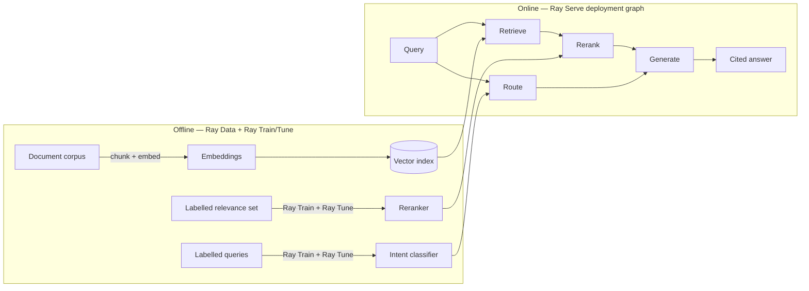

# ray-rag-intelligence

**A distributed RAG document-intelligence platform on Ray — trained ML owns retrieval ranking and query routing; the LLM only writes citation-grounded answers. One codebase, laptop to cluster.**

Ask a question over a document corpus and get back an answer where **every claim
cites the source chunk it came from**. The retrieval quality and the query
routing are owned by *trained models with measured accuracy* — not by the LLM —
so the system is auditable, not a black box that "sounds confident."

---

## Why this exists

Most "RAG" demos let the LLM do everything: rank, route, and answer. That hides
where errors come from and can't be measured. This project takes the opposite,
**anti-fake-AI** stance:

| Job | Owner | How it's measured |
|-----|-------|-------------------|
| Embed & retrieve candidates | Embedding model + vector index | recall@k |
| **Rank the evidence** | **Trained cross-encoder reranker** | **nDCG@k / MRR** |
| **Route the query** (factual / summarise / out-of-scope) | **Trained intent classifier** | **accuracy / macro-F1** |
| Write the grounded answer | LLM (Claude) | citation-faithfulness score |

The LLM is used *only* for what it is genuinely best at — turning ranked
evidence into fluent, **cited** language. It never ranks or routes.

## Architecture



**Ray, end to end:** Ray Data (parallel embed) → Ray Train + Ray Tune (train &
tune both models) → Ray Serve (the online `retrieve → rerank → route → generate`
deployment graph).

## Run it locally

> Requires Docker. CPU-only; no GPU needed. Python 3.10.

```bash
cp .env.example .env          # add your ANTHROPIC_API_KEY
docker compose up -d          # local Ray head + worker cluster
# ingest + embed the sample corpus, train the models, then serve:
make ingest && make train && make serve
# ask a question:
curl -s localhost:8000/ask -d '{"query": "..."}' | jq
```

`make ingest` builds the FAISS index from the corpus, `make train` tunes + fits
the reranker and intent classifier (saved under `artifacts/`, gitignored), and
`make serve` starts the deployment graph. `make eval` prints the metrics below.
See [RUNBOOK.md](RUNBOOK.md) for startup order and failure handling.

## Why this stack

- **Ray** gives one programming model across data, training, tuning, and serving
  — the same code runs on a laptop or a cluster, which is the whole portability
  story.
- **Cross-encoder reranker + intent classifier** are real trained models that
  own measurable prediction, keeping the AI honest.
- **Claude API** does the one thing an LLM should here: grounded generation.

## Results (sample corpus)

Measured by `make eval` on the bundled illustrative corpus — small by design, so
read these as a working signal, not a benchmark:

| Metric | Value |
|--------|-------|
| Retrieval nDCG@5 — dense-only → **learned rerank** | 0.885 → **0.980** |
| Retrieval MRR — dense-only → learned rerank | 0.914 → **1.000** |
| Intent classifier — held-out macro-F1 | **0.926** |

The reranker uplift is the point: a model we train measurably improves the
ordering the LLM reads, over dense retrieval alone.

## Honest disclaimer

- **Generation uses an external LLM API (Anthropic Claude)** on the happy path,
  because the reference machine has no GPU. This is a real API call for a real
  language task — not a mock.
- **A Ray Serve + vLLM-on-GPU serving path and an Anyscale cluster deployment
  are architected and documented (`deploy/`), but are not continuously
  running.** Treat them as the production scale-out story, not a live endpoint.
- Eval sets shipped here are **illustrative-scale**, sized to run quickly and
  reproducibly — not production-scale benchmarks.

## License

MIT — see [LICENSE](LICENSE).
